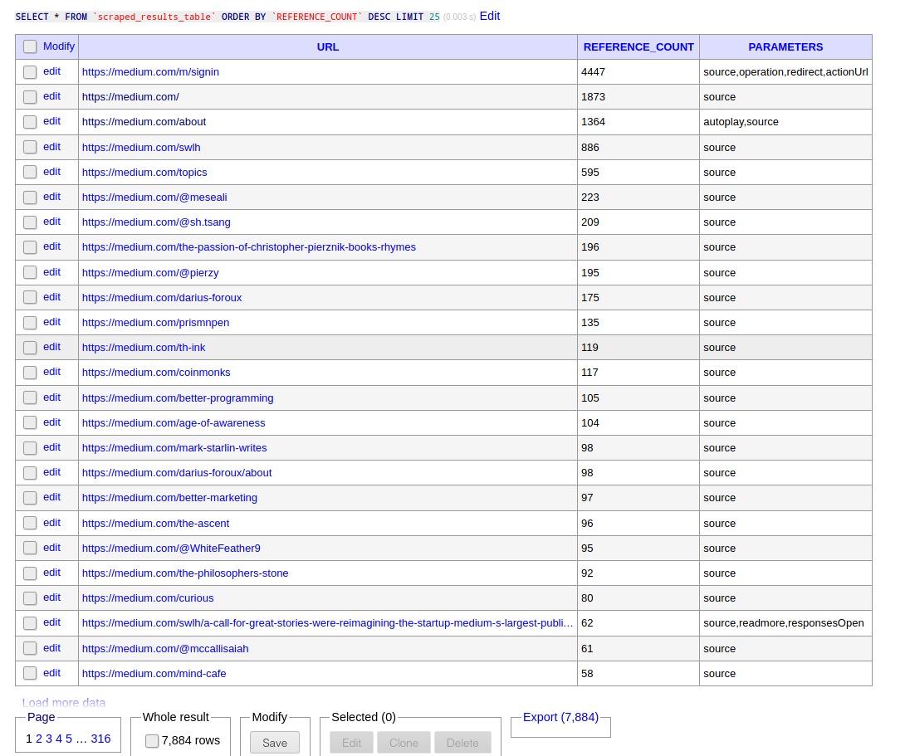

# NodeJS Recursive Scraper

A simple asynchronous recursive scraper using NodeJS for scraping websites in TypeScript and NodeJS.

# Running locally

Running locally requires `docker` and `docker-compose` installed. Regardless of running natively or via Docker, the database is provisioned using Docker.

Clone this repository

```
$ git clone https://github.com/TheIllusionistMirage/nodejs-recursive-scraper
$ cd nodejs-recursive-scraper
```

Start the database Docker containers for the database instance (MySQL) and Adminer (to easily view the data in the database) using `docker-compose`:

```
$ docker-compose-db.yml
````

Wait for MySQL to start up and once ready, you can now navigate to `http://localhost:8080` and login to Adminer using these credentials.

You can navigate to the table `scraped_results_table` at `http://localhost:8080/?server=dbMysql&username=root&db=scraped_results&select=scraped_results_table`. It is a very simple table with the required fields. And initially, there is no data.

## Natively

To run the scraper, install the NodeJS depenendencies

```
$ npm install
```

Run the scraper

```
$ npm run start:local
```

This will run scraper once for `https://medium.com`. You can see it in action by refreshing the page for `scraped_results_table` every few seconds and you should see it getting populated slowly.

## Docker

Build the container image for the scraper

```
$ chmod +x build-scraper-container.sh
$ ./build-scraper-container.sh
```

There are two `docker-compose` scripts that contain the database (MySQL), a DB viwer (Adminer) (`docker-compose-db.yml`), and the other image contains the scraper (`docker-compose-app.yml`). 

There are two steps to running the scraper. First, launch the containers for running the DB and Adminer as stated in the previous section.

Once it is up, and MySQL has started running, we can run the scraper. The scraper is a CLI NodeJS app, so it will run and immediately exit once the scraping process is complete.

```
$ docker-compose -f docker-compose-app.yml up
```

This will start the container for the scraper. You can see it in action by refreshing the page for `scraped_results_table` every few seconds and you should see it getting populated slowly.

# Approach

## Tech used

This scraper is written in Typescript and NodeJS. It uses a containerized MySQL database to store the results of the scraping process. It additionally uses the [workerpool](https://github.com/josdejong/workerpool) library that implements the thread pool pattern. This library is used to maintain a pool of five "scraper" workers. This ensures that at most five scraper actions are running at a given time and newer jobs get queued in the internal job queue of `workerpool` and wait for their turn to get processed.

## The strategy used for recursive scraping

We start with the root URL `https://example.com`. We fetch the HTML code for the webpage and determine all hyperlinks (`<a href=...>` attributes). Then we check which of these hyperlinks are a part of `https://example.com` (let us call them "valid links") , e.g., `https://example.com/foo` is a valid path of `https://example.com` but `https://twitter.com` is not. Then we check if any of the valid links are not present in the database. If it is present, we simply increment its reference count by one, and then check if it has any new unique parameters. If it does, we append them to the record as well and update the database. The valid links which are not yet recorded in the database, we create new records for them, setting the reference count as one, and storing whatever parameters we found in these valid links. We repeat this process recurively repeat this for each valid link we found on a page. The base case is that if in a page we did not find any new unique valid links, i.e., valid links that are not already recorded in the database, and, if we did not find any currently recorded valid link with a new and unique parameter. If both these conditions are met, we don't scrape any valid links present in the page in question.

Initiating a scraping action does not block the main event loop thread of NodeJS. This done by sideloading each scraping action in a child worker using `workerpool` and the main event loop thread is free to do other things.

The source code (which can be found under `src`) is pretty self explanatory and there are four modules:

* globals: This module contains some objects that are referenced throughout the other modules
* DataStore: This is a very simple (and unoptimized) CRUD API to interact with the database
* scraperWorker: This contains the definition of a worker that represents the action of scraping a web page
* index: This is the main entry point of the scraper CLI


## Shorcuts taken

This scraper has overlooked several things, some of which include the following:

* Ignores subdomains totally, meaning links like `https://blog.medium.com` are not considered at all.
* Reacting to the response statuses 401 (unauthorized to access page), 404 (page not found) and 429 (too many requests). Depending upon the use case in the real world, there are different ways to react to these status codes.
* The CRUD API abstraction used for interacting with the database is not efficient. It fetches required data in pieces instead of requesting them in one go. As a result, we have several queries that can be replaced with a single query.

## Screenshot

Demonstration of the result of a sample run:

